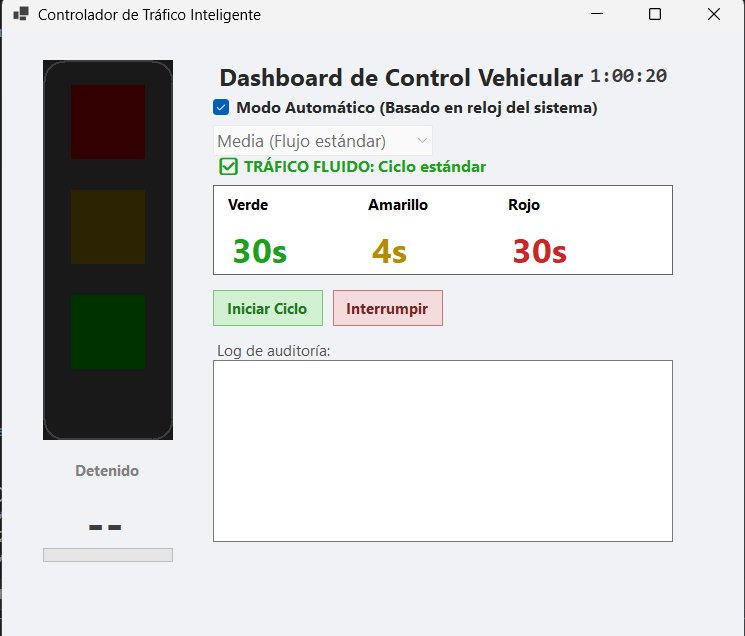
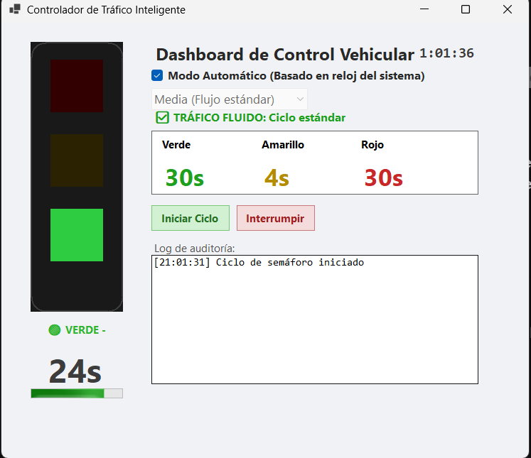

# 🚦 Simulador de Semáforo Inteligente

Un controlador interactivo de tráfico desarrollado en **C# (Windows Forms)**. Este proyecto implementa lógica de control en tiempo real, adaptando los tiempos de las luces según la densidad vehicular y permitiendo la intervención manual.

Ideal para demostrar fundamentos de lógica condicional, manejo de hilos temporales (Timers) y diseño de interfaces de escritorio.

## 🚀 Características Principales

- **Gestión de Fases:** Transiciones automáticas y precisas entre Verde, Amarillo y Rojo.
- **Densidad de Tráfico Dinámica:** Ajuste de tiempos en tiempo real seleccionando la carga vehicular (Baja, Media, Alta/Hora Punta).
- **Modos de Operación:**
  - *Automático:* Ciclo continuo que evalúa condiciones de tráfico.
  - *Manual:* Permite al operador detener la simulación o forzar el inicio de la secuencia.
- **Dashboard en Vivo:** Interfaz gráfica que muestra la cuenta regresiva por fase y el estado actual.
- **Log de Auditoría:** Consola de registro de todos los cambios de estado para trazabilidad.

## 🛠️ Stack Tecnológico

- **Lenguaje:** C#
- **Framework:** .NET / Windows Forms
- **Conceptos:** POO, Enums, Manejo de Eventos (Event Handlers), Manipulación de UI.

## 📸 Vista Previa

| Vista Principal | Detalles de Ejecución |
| :---: | :---: |
|  |  |

## ⚙️ Cómo probarlo

1. Clona este repositorio o descarga el código en `.zip`.
2. Abre el archivo de la solución `.slnx` o `.sln` en Visual Studio.
3. Presiona `F5` o haz clic en "Iniciar" para compilar y ejecutar la aplicación.
